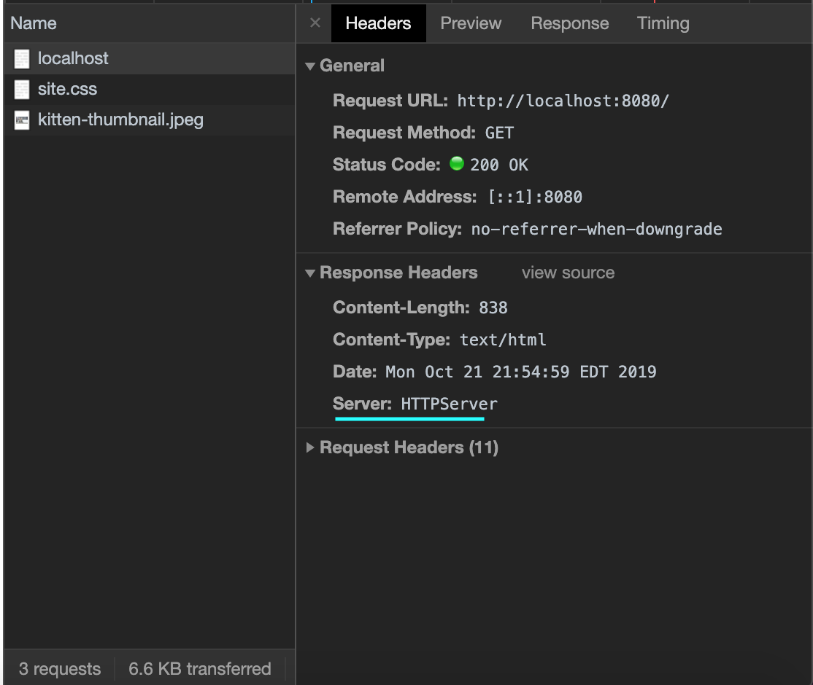

## COS 460/540 - Computer Networks
# Project 2: HTTP Server

# Dejan Tisma

This project is written in Java on Windows mostly, (sent to my Mac, tested and submitted from Mac).

## __How to compile__
1. Clone or download this repo
2. Change directory into the /src/ folder
    ```
    Dejans-MacBook-Pro:project-2-dejantisma-master dejantisma$ ls
    PLAYBOOK.md	README.md	imgs		src		www
    Dejans-MacBook-Pro:project-2-dejantisma-master dejantisma$ cd src
    Dejans-MacBook-Pro:src dejantisma$ ls
    HTTPServer.java	resources
    Dejans-MacBook-Pro:src dejantisma$ 
    ```
3. Compile HTTPServer.java using javac
    ```
    Dejans-MacBook-Pro:src dejantisma$ javac HTTPServer.java
    ```


## __How to run__
### Either..
1. Update the configuration file with port number and document root path located @
```
project-2-dejantisma-master/src/resources/config.properties
```
and then run
```
java HTTPServer
```

### or

2. Pass the port number and document root as command line arguments.
```
java HTTPServer [port] <docroot>
```
Where [ ] is optional (defaults to 8080) and < > is required.

## __My experience with this project__

I had known about headers a little bit prior, but this project demonstrated more about how they were interpreted by the browser. For example, I read from [Mozilla docs on MIME types](https://developer.mozilla.org/en-US/docs/Web/HTTP/Basics_of_HTTP/MIME_types) the following:
```
If a server doesn't recognize the .css suffix for CSS files, it may send them with text/plain or application/octet-stream MIME types. If so, they won't be recognized as CSS by most browsers and will be ignored.
```

I'm not sure if I ever used Runnable or Threads in my previous assignments although the concept I already understood, so that wasn't bad. 

I also played around with favicon.ico. I noticed for me that Firefox would request it when I would first loaded localhost:8080. I served the kitten2-thumbnail.jpeg for it, in a method that I have since deleted, but all you would need is serve some HTML like:
```
<link rel="shortcut icon" href="http://example.com/favicon.ico" /> 
```
per https://www.html.am/html-codes/image-codes/html-favicon-code.cfm

Overall, it was an interesting project, something that crossed my mind was iterating over files in a directory, and showing those files. So if the user requested localhost:8080/images, which happens to be a directory,  it'd be neat if we served HTML that can direct you to each image (instead of 404). Something like:

[kitten-large](www/images/kitten-large.jpeg)

[kitten-thumbnail](www/images/kitten-thumbnail.jpeg)

[kitten2-thumbnail](www/images/kitten2-thumbnail.jpeg)

I talk more about some things I learned in the Notes below which talks more about my implementation. 

## __Notes__
If there are *no* command line arguments, program will assume that the parameters are in config.properties. There is some error checking for input. The program will catch a NumberFormatException (in either case, command line or config) if the port cannot be parsed as an int, and exit.

Server can 'serve' the following: 
- .html
- .css
- .txt
- .json
- .pdf
- .jpeg
- .png
- .mp4
- .mpeg

with their respective MIME types.

__Important:__ the file must not have substring '*%20*' in it. 
For example, say we have a file in ~/www/ called 'My File.pdf'. Now if a user typed in the browser `localhost:8080/My File.pdf`, the request parsed up would look like
```
Request received: 
INDEX = 0 = GET
INDEX = 1 = /My%20File.pdf
INDEX = 2 = HTTP/1.1
```
That %20 is URL encoding, but our file is stored as ~/www/My File.pdf (note the space), so the program replaces any instance of '%20' with ' '.

I could've just not dealt with spaces and instead assumed files didn't have spaces (could be separated with underscores _ instead), but upon testing with other files I had, I decided to implement it like this. (who names files %20 anyway?).
___
## Examples
### Browser
(renders the file)


### Telnet
(source of file)


### Chrome Developer Tools
Here you can see what was requested (by the client/browser) and what was served (by the server/my program). 
Ex. ```out.println("Server: HTTPServer");```
is reflected under Response Headers as ```Server: HTTPServer```

